# Design Document: What's Up Doc Healthcare Navigation Platform

## Overview

What's Up Doc is an intelligent healthcare navigation platform that leverages AI-powered symptom assessment to route patients to appropriate healthcare facilities in India. The system combines natural language processing, emergency detection algorithms, and geospatial facility matching to provide rapid, accurate healthcare guidance without providing medical diagnosis.

The platform addresses the critical healthcare navigation problem in India where patients often choose inappropriate care levels - either rushing to expensive private hospitals for minor issues or selecting facilities lacking required specialization. By implementing conservative emergency detection (prioritizing false positives over false negatives) and evidence-based facility routing, the system aims to achieve 95%+ emergency detection accuracy and 80%+ appropriate care routing.

## Architecture

The system follows a serverless microservices architecture on AWS, designed for high availability and scalability to support emergency healthcare scenarios.

### High-Level Architecture

```mermaid
graph TB
    subgraph "Client Layer"
        WEB[Web App - React.js]
        MOBILE[Mobile App - React Native]
        VOICE[Voice Interface]
    end
    
    subgraph "API Gateway & Authentication"
        APIGW[AWS API Gateway]
        COGNITO[Amazon Cognito]
    end
    
    subgraph "Core Services"
        AUTH[Authentication Service]
        SYMPTOM[Symptom Assessment Service]
        EMERGENCY[Emergency Detection Service]
        FACILITY[Facility Routing Service]
        LOCATION[Location Service]
        REPORT[Medical Report Analysis Service]
    end
    
    subgraph "AI/ML Services"
        BEDROCK[Amazon Bedrock - Claude Sonnet]
        COMPREHEND[AWS Comprehend Medical]
        TRANSCRIBE[Amazon Transcribe]
        TEXTRACT[Amazon Textract]
        REKOGNITION[Amazon Rekognition Medical]
    end
    
    subgraph "Data Layer"
        DYNAMO[DynamoDB - Patient Data]
        RDS[PostgreSQL - Facility Data]
        S3[S3 - Document Storage]
        OPENSEARCH[OpenSearch - Facility Search]
        REPORTS_S3[S3 - Medical Reports]
    end
    
    subgraph "External Services"
        MAPS[Amazon Location Service]
        SMS[Amazon SNS]
        GOVT_API[Government Data APIs]
        OTP[OTP Service Provider]
    end
    
    WEB --> APIGW
    MOBILE --> APIGW
    VOICE --> TRANSCRIBE
    APIGW --> COGNITO
    APIGW --> AUTH
    APIGW --> SYMPTOM
    APIGW --> EMERGENCY
    APIGW --> FACILITY
    APIGW --> LOCATION
    APIGW --> REPORT
    
    AUTH --> COGNITO
    AUTH --> OTP
    SYMPTOM --> BEDROCK
    SYMPTOM --> COMPREHEND
    EMERGENCY --> BEDROCK
    FACILITY --> OPENSEARCH
    FACILITY --> RDS
    LOCATION --> MAPS
    REPORT --> TEXTRACT
    REPORT --> REKOGNITION
    REPORT --> BEDROCK
    REPORT --> COMPREHEND
    
    SYMPTOM --> DYNAMO
    FACILITY --> DYNAMO
    EMERGENCY --> SMS
    AUTH --> DYNAMO
    REPORT --> REPORTS_S3
    REPORT --> DYNAMO
    
    RDS --> GOVT_API
```



### Service Architecture Patterns

**Event-Driven Architecture**: Emergency detection triggers immediate notifications and facility routing without waiting for user confirmation.

**Circuit Breaker Pattern**: If AI services (Bedrock) are unavailable, the system gracefully degrades by showing all nearby facilities with appropriate warnings.

**Caching Strategy**: Facility data cached in OpenSearch for sub-second search performance, with Redis for session data and frequently accessed facility information.

## Components and Interfaces

### 1. Authentication Service

**Purpose**: Manage user registration, login, and session management with secure phone-based authentication.

**Core Components**:
- **OTP Generation Module**: Creates and validates time-based one-time passwords
- **Phone Verification Service**: Integrates with SMS providers for phone number verification
- **Session Management**: Handles user sessions with JWT tokens and refresh mechanisms
- **Profile Management**: Stores and manages user profile data and preferences
- **Biometric Integration**: Supports device-based biometric authentication

**Interface**:
```typescript
interface AuthenticationRequest {
  phoneNumber: string;
  countryCode: string;
  deviceId?: string;
}

interface AuthenticationResponse {
  sessionToken: string;
  refreshToken: string;
  userId: string;
  profile: UserProfile;
  expiresAt: string;
}

interface UserProfile {
  userId: string;
  phoneNumber: string;
  age: number;
  gender: 'male' | 'female' | 'other';
  preferredLanguage: 'hi' | 'en' | 'hi-en';
  chronicConditions: string[];
  insuranceType: 'cghs' | 'esi' | 'pmjay' | 'private' | 'none';
  emergencyContacts: EmergencyContact[];
}
```

**Security Features**:
- Rate limiting for OTP requests (max 3 per 10 minutes)
- Device fingerprinting for fraud detection
- Session timeout and automatic refresh
- Secure token storage with encryption

### 2. Medical Report Analysis Service

**Purpose**: Process and analyze uploaded medical documents to extract key findings and integrate with symptom assessment.

**Core Components**:
- **Document Processing Engine**: Handles PDF, image, and document format conversion
- **OCR and Text Extraction**: Uses Amazon Textract for text extraction from images and scanned documents
- **Medical Entity Recognition**: Leverages AWS Comprehend Medical to identify medical entities, conditions, and medications
- **Report Classification**: Categorizes reports by type (lab results, prescriptions, diagnostic images, clinical notes)
- **Critical Finding Detection**: Identifies abnormal values and urgent medical findings
- **Integration Engine**: Combines report findings with symptom assessment for enhanced routing

**Interface**:
```typescript
interface ReportUploadRequest {
  userId: string;
  reportFile: File;
  reportType: 'lab_result' | 'prescription' | 'diagnostic_image' | 'clinical_note' | 'unknown';
  reportDate?: string;
  providerId?: string;
}

interface ReportAnalysisResponse {
  reportId: string;
  analysisStatus: 'processing' | 'completed' | 'failed';
  extractedData: {
    textContent: string;
    medicalEntities: MedicalEntity[];
    keyFindings: Finding[];
    abnormalValues: AbnormalValue[];
    medications: Medication[];
    criticalFlags: CriticalFlag[];
  };
  summary: {
    primaryFindings: string[];
    recommendedActions: string[];
    specialistReferrals: string[];
    followUpRequired: boolean;
  };
  integrationData: {
    severityModifier: number; // -2 to +3 adjustment to symptom severity
    recommendedDepartments: string[];
    contraindications: string[];
  };
}

interface MedicalEntity {
  text: string;
  category: 'MEDICATION' | 'CONDITION' | 'TEST_NAME' | 'TEST_VALUE' | 'ANATOMY';
  confidence: number;
  attributes: EntityAttribute[];
}

interface Finding {
  category: 'normal' | 'abnormal' | 'critical';
  description: string;
  confidence: number;
  recommendedAction?: string;
}
```

**Processing Pipeline**:
1. **Document Upload**: Secure upload to S3 with virus scanning
2. **Format Detection**: Identify document type and structure
3. **Text Extraction**: OCR processing for images, direct text extraction for PDFs
4. **Medical NLP**: Entity recognition and relationship extraction
5. **Clinical Analysis**: Pattern matching against medical knowledge base
6. **Critical Assessment**: Flag urgent findings requiring immediate attention
7. **Integration Preparation**: Generate data for symptom assessment enhancement

### 3. Symptom Assessment Engine

**Purpose**: Process natural language symptom input and generate severity scores without medical diagnosis.

**Core Components**:
- **Language Detection Module**: Identifies Hindi/English/Hinglish using AWS Comprehend
- **Symptom Parser**: Extracts medical entities using AWS Comprehend Medical
- **Severity Scorer**: Uses Claude Sonnet with medical prompting to assign 1-10 severity scores
- **Question Generator**: Creates contextual follow-up questions based on initial symptoms

**Interface**:
```typescript
interface SymptomAssessmentRequest {
  patientId: string;
  symptomsText: string;
  language: 'hi' | 'en' | 'hi-en';
  patientContext: {
    age: number;
    gender: 'male' | 'female' | 'other';
    chronicConditions: string[];
  };
}

interface SymptomAssessmentResponse {
  assessmentId: string;
  severityScore: number; // 1-10
  careLevel: 'phc' | 'clinic' | 'hospital' | 'emergency';
  emergencyFlags: string[];
  clarifyingQuestions: Question[];
  recommendedDepartments: string[];
}
```

**AI Prompting Strategy**:
The system uses structured prompts with Claude Sonnet that include:
- Medical context and Indian healthcare system knowledge
- Conservative emergency detection instructions
- Explicit instructions to never provide diagnosis
- Severity scoring rubric based on clinical triage protocols

### 2. Emergency Detection System

**Purpose**: Identify life-threatening symptoms requiring immediate medical attention with 95%+ recall rate.

**Detection Algorithm**:
1. **Keyword Matching**: Real-time scanning for emergency terms (chest pain, severe bleeding, breathlessness, stroke signs)
2. **Contextual Analysis**: Claude Sonnet evaluates symptom combinations and severity indicators
3. **Conservative Flagging**: System errs on the side of caution - false positives preferred over false negatives
4. **Multi-language Support**: Emergency detection works across Hindi, English, and Hinglish

**Emergency Keywords Database**:
```typescript
const EMERGENCY_KEYWORDS = {
  chest_pain: ['chest pain', 'सीने में दर्द', 'heart attack', 'दिल का दौरा'],
  severe_bleeding: ['severe bleeding', 'बहुत खून', 'heavy bleeding', 'ज्यादा खून'],
  breathing: ['can\'t breathe', 'सांस नहीं आ रही', 'breathless', 'दम घुट रहा'],
  stroke: ['stroke symptoms', 'लकवा', 'face drooping', 'मुंह टेढ़ा'],
  consciousness: ['unconscious', 'बेहोश', 'passed out', 'गिर गया']
};
```

**Response Protocol**:
- Immediate severity upgrade to level 9-10
- Skip non-critical clarifying questions
- Display prominent warning messages
- Show ambulance numbers (108/102)
- Route only to emergency-capable facilities

### 3. Healthcare Facility Routing Engine

**Purpose**: Match patients to appropriate healthcare facilities based on symptom severity, location, and facility capabilities.

**Routing Algorithm**:
1. **Distance-Based Filtering**: Apply radius constraints based on severity level
2. **Capability Matching**: Filter facilities by required departments and services
3. **Composite Scoring**: Rank facilities using weighted algorithm:
   - Facility capabilities: 50%
   - Distance/travel time: 30% 
   - Insurance scheme acceptance: 20%
4. **Government Prioritization**: Boost ranking for government facilities for mild-moderate cases

**Geospatial Search Implementation**:
```typescript
interface FacilitySearchCriteria {
  location: {
    latitude: number;
    longitude: number;
  };
  maxDistanceKm: number;
  requiredDepartments: string[];
  facilityTypes: ('phc' | 'clinic' | 'hospital' | 'emergency')[];
  insuranceSchemes: ('cghs' | 'esi' | 'pmjay')[];
}

interface FacilityResult {
  facilityId: string;
  name: string;
  distanceKm: number;
  travelTimeMinutes: number;
  matchScore: number; // 0-100
  capabilities: {
    departments: string[];
    emergencyServices: boolean;
    icuAvailable: boolean;
  };
  acceptedSchemes: string[];
  estimatedCost: {
    min: number;
    max: number;
  };
}
```

**Distance Calculation**:
- Uses Haversine formula for initial filtering
- Amazon Location Service for precise routing and travel time
- Caches common routes to improve performance

### 4. Multi-Language Processing System

**Purpose**: Support Hindi, English, and Hinglish input with consistent user experience.

**Components**:
- **Language Detection**: AWS Comprehend identifies primary language
- **Translation Layer**: Maintains context while translating for AI processing
- **Response Localization**: Generates responses in user's preferred language
- **Voice Processing**: Amazon Transcribe for Hindi/English speech-to-text

**Implementation Strategy**:
- Process all inputs in English internally for consistency
- Maintain language preference throughout user session
- Use culturally appropriate medical terminology
- Support code-switching (Hinglish) common in Indian communication

### 5. Location and Mapping Services

**Purpose**: Provide accurate location-based facility search and navigation.

**Components**:
- **Geocoding Service**: Convert pincode to coordinates using Amazon Location Service
- **Reverse Geocoding**: Determine area/district from GPS coordinates
- **Route Calculation**: Generate turn-by-turn directions to selected facilities
- **Map Visualization**: Display facilities with color-coded markers

**Caching Strategy**:
- Cache pincode-to-coordinate mappings (static data)
- Cache facility search results for 1 hour
- Pre-compute distances for major city centers

## Data Models

### Patient Data Model (DynamoDB)

```typescript
interface Patient {
  patientId: string; // Partition Key
  phoneNumber: string; // GSI
  profile: {
    age: number;
    gender: 'male' | 'female' | 'other';
    preferredLanguage: 'hi' | 'en' | 'hi-en';
    chronicConditions: string[];
    insuranceType: 'cghs' | 'esi' | 'pmjay' | 'private' | 'none';
    emergencyContacts: EmergencyContact[];
  };
  location: {
    pincode: string;
    latitude?: number;
    longitude?: number;
  };
  authentication: {
    phoneVerified: boolean;
    lastLoginAt: string;
    deviceIds: string[];
    biometricEnabled: boolean;
  };
  createdAt: string;
  updatedAt: string;
}

interface EmergencyContact {
  name: string;
  phoneNumber: string;
  relationship: string;
}
```

### Medical Report Data Model (DynamoDB)

```typescript
interface MedicalReport {
  reportId: string; // Partition Key
  userId: string; // GSI
  reportMetadata: {
    originalFileName: string;
    fileSize: number;
    mimeType: string;
    uploadedAt: string;
    reportDate: string;
    reportType: 'lab_result' | 'prescription' | 'diagnostic_image' | 'clinical_note';
    providerId?: string;
    providerName?: string;
  };
  storageLocation: {
    s3Bucket: string;
    s3Key: string;
    encryptionKey: string;
  };
  analysisResults: {
    processingStatus: 'pending' | 'processing' | 'completed' | 'failed';
    extractedText: string;
    medicalEntities: MedicalEntity[];
    keyFindings: Finding[];
    abnormalValues: AbnormalValue[];
    medications: Medication[];
    criticalFlags: CriticalFlag[];
    confidenceScore: number;
  };
  clinicalSummary: {
    primaryFindings: string[];
    recommendedActions: string[];
    specialistReferrals: string[];
    followUpRequired: boolean;
    severityIndicators: string[];
  };
  integrationData: {
    severityModifier: number;
    recommendedDepartments: string[];
    contraindications: string[];
    lastIntegratedAt?: string;
  };
  accessControl: {
    sharedWith: string[]; // Healthcare provider IDs
    shareExpiresAt?: string;
    accessLevel: 'private' | 'shared' | 'public';
  };
  createdAt: string;
  updatedAt: string;
  ttl?: number; // Optional auto-delete
}

interface AbnormalValue {
  testName: string;
  value: string;
  normalRange: string;
  severity: 'mild' | 'moderate' | 'severe' | 'critical';
  unit: string;
}

interface CriticalFlag {
  category: 'urgent_referral' | 'medication_interaction' | 'abnormal_critical' | 'follow_up_required';
  description: string;
  priority: 'high' | 'medium' | 'low';
  recommendedAction: string;
}
```

### User Session Data Model (DynamoDB)

```typescript
interface UserSession {
  sessionId: string; // Partition Key
  userId: string; // GSI
  deviceInfo: {
    deviceId: string;
    platform: string;
    appVersion: string;
    ipAddress: string;
  };
  authenticationData: {
    loginMethod: 'otp' | 'biometric' | 'guest';
    loginAt: string;
    lastActivityAt: string;
    refreshTokenHash: string;
  };
  sessionData: {
    currentAssessmentId?: string;
    preferredLanguage: string;
    locationPermission: boolean;
    notificationPreferences: NotificationPreferences;
  };
  expiresAt: string;
  ttl: number; // Auto-delete expired sessions
}
```

### Assessment Data Model (DynamoDB)

```typescript
interface SymptomAssessment {
  assessmentId: string; // Partition Key
  patientId: string; // GSI
  symptoms: {
    originalText: string;
    language: string;
    processedEntities: MedicalEntity[];
  };
  severity: {
    score: number; // 1-10
    careLevel: string;
    emergencyFlags: string[];
  };
  responses: {
    questionId: string;
    answer: string;
  }[];
  recommendations: {
    facilities: FacilityResult[];
    selectedFacility?: string;
  };
  status: 'in_progress' | 'completed' | 'abandoned';
  createdAt: string;
  ttl: number; // Auto-delete after 90 days
}
```

### Healthcare Facility Data Model (PostgreSQL with PostGIS)

```sql
CREATE TABLE healthcare_facilities (
  facility_id UUID PRIMARY KEY,
  name VARCHAR(255) NOT NULL,
  facility_type VARCHAR(50) NOT NULL, -- 'phc', 'clinic', 'hospital', 'emergency'
  location GEOGRAPHY(POINT, 4326) NOT NULL,
  address JSONB NOT NULL,
  contact JSONB NOT NULL,
  departments TEXT[] NOT NULL,
  services JSONB NOT NULL, -- emergency_services, icu_available, etc.
  insurance_schemes TEXT[] NOT NULL,
  operational_hours JSONB,
  government_schemes TEXT[],
  last_verified TIMESTAMP,
  created_at TIMESTAMP DEFAULT NOW(),
  updated_at TIMESTAMP DEFAULT NOW()
);

-- Geospatial index for fast location-based queries
CREATE INDEX idx_facilities_location ON healthcare_facilities USING GIST (location);
CREATE INDEX idx_facilities_type ON healthcare_facilities (facility_type);
CREATE INDEX idx_facilities_departments ON healthcare_facilities USING GIN (departments);
```

### Symptom-Department Mapping (PostgreSQL)

```sql
CREATE TABLE symptom_department_mapping (
  mapping_id UUID PRIMARY KEY,
  symptom_category VARCHAR(100) NOT NULL,
  keywords TEXT[] NOT NULL,
  primary_departments TEXT[] NOT NULL,
  emergency_indicators TEXT[],
  severity_modifiers JSONB,
  created_at TIMESTAMP DEFAULT NOW()
);
```

## Correctness Properties

*A property is a characteristic or behavior that should hold true across all valid executions of a system—essentially, a formal statement about what the system should do. Properties serve as the bridge between human-readable specifications and machine-verifiable correctness guarantees.*

Before defining the correctness properties, let me analyze the acceptance criteria for testability:

<function_calls>
<invoke name="prework">
<parameter name="featureName">whats-up-doc

Based on the prework analysis, here are the consolidated correctness properties:

### Property 1: Symptom Processing Performance
*For any* symptom input in any supported language, the system should process the input and return an assessment within 3 seconds under normal load conditions.
**Validates: Requirements 1.1, 2.1, 7.1, 9.1**

### Property 2: Emergency Detection and Response
*For any* symptom input containing emergency keywords (chest pain, severe bleeding, breathlessness, stroke signs, loss of consciousness), the system should automatically flag as emergency, display life-threatening warning message, skip non-critical questions, show ambulance numbers, and route only to emergency facilities.
**Validates: Requirements 2.1, 2.2, 2.3, 2.4**

### Property 3: Severity-Based Facility Routing
*For any* completed symptom assessment, the system should route to appropriate facility types within correct distance radius: mild (≤3) → PHC/dispensaries ≤3km, moderate (4-6) → clinics/hospitals ≤5km, high (7-8) → hospitals ≤10km, emergency (9-10) → emergency facilities ≤10km.
**Validates: Requirements 3.1, 3.2, 3.3, 3.4**

### Property 4: Facility Ranking Algorithm
*For any* facility search results, the system should rank facilities using the composite scoring formula: facility capabilities (50%) + distance (30%) + insurance schemes (20%).
**Validates: Requirements 3.6**

### Property 5: Specialty Department Matching
*For any* symptom input requiring specialized care (pregnancy, chest pain, respiratory, neurological), the system should filter or prioritize facilities with appropriate departments (Obs/Gyn, Cardiology, Pulmonology/ENT, Neurology respectively).
**Validates: Requirements 4.1, 4.2, 4.3, 4.4**

### Property 6: Government Facility Prioritization
*For any* mild to moderate severity assessment, when government facilities are available, the system should rank them higher than private facilities in search results.
**Validates: Requirements 5.3**

### Property 7: Insurance Scheme Integration
*For any* patient with CGHS coverage, the system should prioritize CGHS-empaneled facilities and display accepted insurance schemes for all facility results.
**Validates: Requirements 5.1, 5.2**

### Property 8: Multi-Language Consistency
*For any* user session, when language is detected from initial input, the system should maintain that language for follow-up questions, UI labels, and all responses throughout the session.
**Validates: Requirements 6.1, 6.2, 6.5**

### Property 9: Voice Transcription Accuracy
*For any* voice input in Hindi or English, the system should transcribe speech with greater than 85% accuracy.
**Validates: Requirements 6.4**

### Property 10: Location Services Accuracy
*For any* pincode input, the system should geocode within 1 second and calculate facility distances with ±100 meter accuracy.
**Validates: Requirements 7.1, 7.2**

### Property 11: Search Radius Expansion
*For any* symptom assessment where no appropriate facilities are found within the specified radius, the system should expand search to 20km and display explanatory message.
**Validates: Requirements 3.5**

### Property 12: Emergency Override Persistence
*For any* patient who manually overrides emergency detection, the system should maintain persistent warning banner and continue showing emergency facilities in results.
**Validates: Requirements 2.5**

### Property 13: Data Privacy Compliance
*For any* patient data storage operation, the system should encrypt data using AES-256, store only in Indian data centers, require explicit consent, and provide deletion capability within 30 days of request.
**Validates: Requirements 8.1, 8.2, 8.3, 8.5**

### Property 14: Medical Disclaimer Enforcement
*For any* assessment result or facility recommendation, the system should display appropriate disclaimers ("Not a medical diagnosis", "Consult healthcare provider for medical advice") and never state diagnostic conclusions like "You have [disease]".
**Validates: Requirements 10.1, 10.2, 10.3**

### Property 15: System Reliability and Graceful Degradation
*For any* system failure scenario (AI services unavailable), the system should gracefully degrade by showing all nearby hospitals with appropriate warnings while maintaining 99.5% uptime for emergency detection.
**Validates: Requirements 9.2, 9.3**

### Property 16: User Authentication Security
*For any* user registration or login attempt, the system should verify phone numbers via OTP within 2 minutes, support biometric authentication, and maintain secure session management with automatic logout.
**Validates: Requirements 11.1, 11.2, 11.5**

### Property 17: Guest Mode Emergency Access
*For any* emergency situation, the system should allow guest mode access without requiring registration while maintaining full emergency detection and facility routing capabilities.
**Validates: Requirements 11.6**

### Property 18: Medical Report Processing Performance
*For any* uploaded medical report (PDF, image, or document), the system should process and extract key medical information within 10 seconds.
**Validates: Requirements 12.1**

### Property 19: Critical Finding Detection
*For any* medical report analysis, when critical abnormalities are detected, the system should flag for immediate medical attention and integrate findings with symptom assessment for enhanced facility routing.
**Validates: Requirements 12.4, 12.5**

### Property 20: Report Analysis Integration
*For any* completed medical report analysis, the system should integrate findings with symptom assessment to provide more accurate facility routing and specialist recommendations.
**Validates: Requirements 12.4, 12.8**

## Error Handling

### Authentication Failures
- **OTP Delivery Issues**: Retry with alternative SMS providers, offer voice OTP as fallback
- **Phone Verification Timeout**: Allow re-sending OTP with exponential backoff, maximum 3 attempts per 10 minutes
- **Biometric Authentication Failure**: Fall back to OTP-based authentication, maintain security audit logs
- **Session Expiry**: Automatic token refresh, graceful re-authentication without data loss
- **Account Lockout**: Temporary lockout after 5 failed attempts, unlock via customer support or time-based release

### Medical Report Processing Failures
- **Document Upload Errors**: Retry mechanism with progress indication, support for multiple file formats
- **OCR Processing Failures**: Manual text input option, human review queue for complex documents
- **Medical Entity Recognition Errors**: Confidence scoring with manual review for low-confidence extractions
- **Critical Finding False Positives**: User feedback mechanism to improve AI accuracy, healthcare provider validation
- **Report Analysis Timeout**: Queue processing for large documents, status updates with estimated completion time

### Emergency Detection Failures
- **AI Service Unavailable**: Fall back to keyword-based emergency detection using predefined emergency term database
- **False Negative Risk**: Implement multiple detection layers (keyword + contextual analysis) to minimize missed emergencies
- **Language Processing Errors**: Default to emergency routing if language detection or translation fails for safety

### Facility Search Failures
- **No Facilities Found**: Expand search radius progressively (3km → 5km → 10km → 20km) with explanatory messages
- **Geolocation Errors**: Allow manual pincode entry as fallback, use approximate location based on pincode
- **Database Connectivity Issues**: Serve cached facility data with staleness warnings

### Performance Degradation Handling
- **High Load Scenarios**: Implement request queuing with priority for emergency cases
- **AI Processing Delays**: Show progress indicators and allow users to skip to facility search if assessment takes >10 seconds
- **Network Connectivity**: Cache essential facility data for offline emergency lookup

### Data Privacy Violations
- **Consent Withdrawal**: Immediately stop processing and initiate data deletion workflow
- **Data Breach Detection**: Automatic notification to users and regulatory authorities within 72 hours
- **Cross-Border Data Transfer**: Block requests from outside India, log attempts for security analysis

## Testing Strategy

### Dual Testing Approach

The system requires both unit testing and property-based testing for comprehensive coverage:

**Unit Tests** focus on:
- Specific emergency keyword detection examples
- Edge cases in facility routing (no facilities found, boundary conditions)
- Integration points between services
- Error conditions and fallback behaviors

**Property-Based Tests** focus on:
- Universal properties that hold across all inputs
- Comprehensive input coverage through randomization
- Performance characteristics under various load conditions
- Data consistency and integrity across operations

### Property-Based Testing Configuration

**Testing Framework**: Use fast-check (JavaScript/TypeScript) for property-based testing
**Test Iterations**: Minimum 100 iterations per property test to ensure statistical significance
**Test Data Generation**: 
- Random symptom descriptions in Hindi, English, and Hinglish
- Random patient profiles (age, gender, location, insurance)
- Random facility databases with varying capabilities and locations
- Random emergency scenarios with different keyword combinations

**Property Test Tagging**: Each property test must reference its design document property:
- **Feature: whats-up-doc, Property 1**: Symptom Processing Performance
- **Feature: whats-up-doc, Property 2**: Emergency Detection and Response
- And so on for all 15 properties

### Performance Testing Strategy

**Load Testing Scenarios**:
- Normal load: 1,000 concurrent users
- Peak load: 10,000 concurrent users  
- Emergency spike: 50% emergency cases during disaster scenarios
- Sustained load: 24-hour continuous testing

**Performance Metrics**:
- API response time (p50, p95, p99)
- Emergency detection latency
- Facility search response time
- Database query performance
- AI service response time

### Security Testing

**Penetration Testing**: External security audit focusing on:
- Patient data encryption verification
- API authentication and authorization
- Input validation and injection attacks
- Data residency compliance verification

**Compliance Testing**:
- DPDPA 2023 compliance verification
- Data deletion workflow testing
- Consent management validation
- Cross-border data transfer prevention

### Integration Testing

**External Service Integration**:
- AWS Bedrock API reliability and fallback testing
- Amazon Location Service accuracy verification
- Government data API synchronization testing
- SMS/notification service delivery testing

**End-to-End User Flows**:
- Complete emergency flow from symptom input to facility selection
- Multi-language user journey testing
- Voice input to facility routing workflow
- Data privacy consent and deletion flow

The testing strategy ensures that the system meets its critical requirements of 95%+ emergency detection accuracy and 80%+ appropriate care routing while maintaining the performance and reliability standards necessary for healthcare applications.